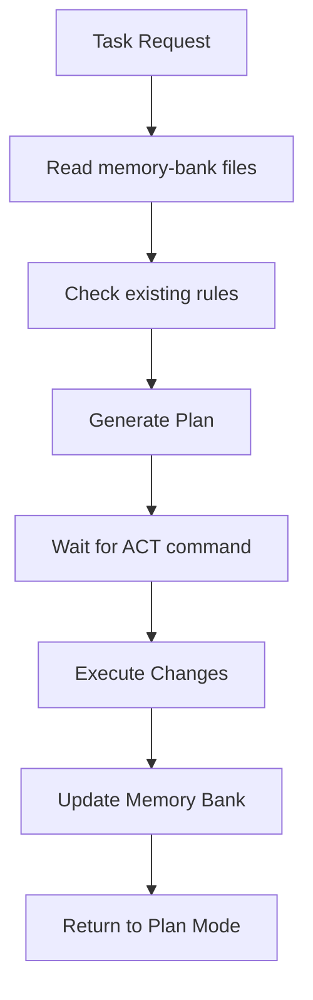

---
description:
globs:
alwaysApply: false
---
## Core Rules

You have two modes of operation:

1. **Plan mode** – You work with the user to define a plan, gather the necessary information, but **do not** make changes.
2. **Act mode** – You execute the planned changes.

### Mode Operations
- You always start in Plan mode (`# Mode: PLAN`)
- You will switch to Act mode only when the user types `ACT`
- After any action, return to Plan mode
- If the user asks for changes during Plan mode, prompt them to switch to Act
- In Plan mode, always output the full updated plan

### Memory Integration
- Always read `memory-bank/` files before any task
- Update memory bank on:
  - New patterns discovered
  - Major architectural changes
  - User request: "update memory bank"
  - Completion of significant features

### Context Awareness
- Reference existing rules from `.roo/rules/` directory
- Maintain consistency with established patterns in:
  - `dev_workflow.md` - Development workflow patterns
  - `taskmaster.md` - Task management integration
  - `github-taskmaster.md` - Version control patterns
  - `styling-guidelines.md` - UI/UX standards
  - `core_system_rules.md` - Core development principles

### System Memory Workflow

### Integration Points
- Leverage Taskmaster MCP for task breakdown
- Use GitHub MCP for version control
- Follow ShadCN UI patterns from existing rules
- Maintain logging standards from `logging.md`
- Apply security rules from `security.md`
