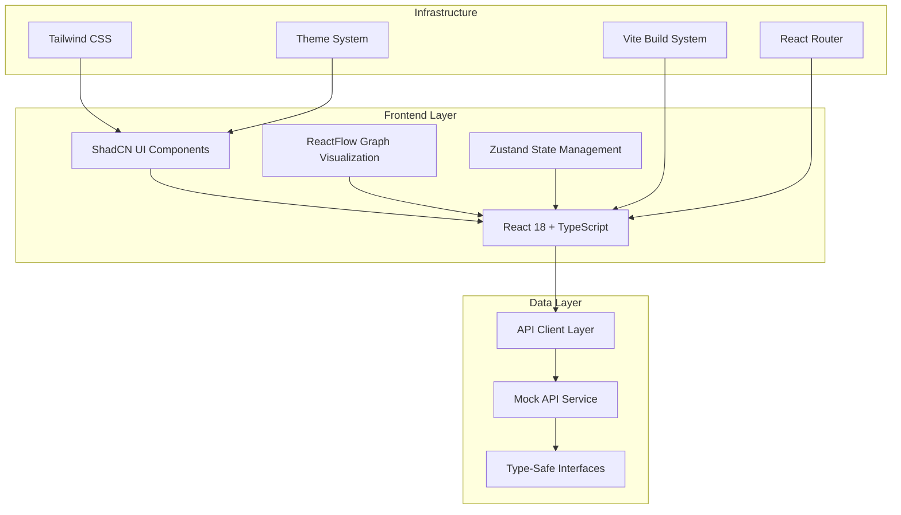

# Huzzology Architecture Overview

## Project Mission
Huzzology is a real-time visual mapping application for women's pop culture archetypes, trends, and aesthetics. The core mission is to help users understand evolving cultural moments through interactive data visualization.

## System Architecture

### High-Level Architecture


## Tech Stack

### Frontend Framework
- **React 18.3.1**: Modern React with concurrent features and improved performance
- **TypeScript 5.6.2**: Full type safety across the application
- **Vite 5.4.2**: Fast build tool and development server

### UI Framework & Styling
- **ShadCN UI**: Component library built on Radix UI primitives
- **Tailwind CSS 3.4.1**: Utility-first CSS framework
- **Radix UI**: Accessible, unstyled UI primitives
- **Class Variance Authority (CVA)**: Type-safe component variants
- **Tailwind Merge**: Intelligent Tailwind class merging

### State Management
- **Zustand 5.0.1**: Lightweight state management with TypeScript support
- **React Context**: Theme management and provider patterns

### Routing & Navigation
- **React Router 6.28.0**: Type-safe routing with error boundaries
- **Custom Navigation Hooks**: Type-safe navigation utilities

### Data Visualization
- **ReactFlow 12.3.2**: Interactive node-based graph visualization
- **Dagre**: Automatic graph layout algorithms
- **Custom Node Components**: Archetype-specific visualization components

### Development Tools
- **ESLint**: Code linting with TypeScript support
- **Prettier**: Code formatting
- **Vitest**: Unit testing framework
- **React Testing Library**: Component testing utilities

## Component Architecture

### UI Component Structure
```
src/components/
├── ui/                    # ShadCN UI Components (30+ components)
│   ├── button.tsx         # Primary button component
│   ├── card.tsx          # Card layouts
│   ├── input.tsx         # Form inputs
│   ├── select.tsx        # Dropdown selections
│   ├── dialog.tsx        # Modal dialogs
│   ├── toast.tsx         # Notification system
│   ├── theme-toggle.tsx  # Theme switching
│   └── ...               # Additional UI primitives
├── graph/                # Graph Visualization Components
│   ├── ArchetypeNode.tsx # Custom ReactFlow node
│   ├── GraphVisualization.tsx # Main graph component
│   └── index.ts          # Component exports
├── layout/               # Layout System Components
│   ├── AppLayout.tsx     # Main layout wrapper
│   ├── AppHeader.tsx     # Navigation header
│   ├── AppSidebar.tsx    # Collapsible sidebar
│   └── AppFooter.tsx     # Footer component
├── ErrorBoundary.tsx     # Error boundary for routing
└── Layout.tsx            # Legacy layout component
```

### State Management Architecture
```typescript
// Zustand Store Structure
interface ArchetypeStore {
  // State
  archetypes: ArchetypeNode[];
  selectedArchetype: string | null;
  isLoading: boolean;
  error: string | null;
  
  // Actions
  setArchetypes: (archetypes: ArchetypeNode[]) => void;
  setSelectedArchetype: (id: string | null) => void;
  addArchetype: (archetype: ArchetypeNode) => void;
  updateArchetype: (archetype: ArchetypeNode) => void;
  removeArchetype: (id: string) => void;
  setLoading: (loading: boolean) => void;
  setError: (error: string | null) => void;
}
```

## Data Flow Architecture

### Type System
```typescript
// Core Data Types
interface ArchetypeNode {
  id: string;
  label: string;
  description: string;
  keywords: string[];
  influences: string[];
  examples: ContentExample[];
  color: string;
  metadata: ArchetypeMetadata;
}

interface ContentExample {
  id: string;
  platform: Platform;
  url: string;
  caption?: string;
  timestamp: string;
  engagement_metrics?: EngagementMetrics;
  creator?: Creator;
}

type Platform = 'tiktok' | 'twitter' | 'instagram' | 'reddit' | 'pinterest' | 'youtube' | 'tumblr';
```

### API Integration Layer
- **API Client**: Type-safe HTTP client with error handling
- **Mock API Service**: Development-time data simulation
- **Custom Hooks**: React hooks for data fetching (`useApi.ts`)
- **Error Boundaries**: Graceful error handling and recovery

## Theme System

### Theme Architecture
- **Theme Provider**: React Context-based theme management
- **Theme Persistence**: localStorage integration with SSR handling
- **Theme Modes**: Light, Dark, and System preference detection
- **CSS Integration**: Tailwind dark mode classes with automatic application

### Theme Implementation
```typescript
interface ThemeContextType {
  theme: 'light' | 'dark' | 'system';
  setTheme: (theme: 'light' | 'dark' | 'system') => void;
  actualTheme: 'light' | 'dark';
}
```

## Routing Architecture

### Route Configuration
```typescript
// Type-safe route definitions
export const ROUTES = {
  HOME: '/',
  EXPLORE: '/explore',
  GRAPH: '/graph',
  COMPONENTS: '/components',
  API_DEMO: '/api-demo',
  GRAPH_DEMO: '/graph-demo',
  LAYOUT_DEMO: '/layout',
} as const;
```

### Error Handling
- **Error Boundaries**: Component-level error catching
- **404 Handling**: Custom not found pages
- **Route Protection**: Future authentication integration points

## Graph Visualization System

### ReactFlow Integration
- **Custom Node Types**: Archetype-specific node components
- **Layout Algorithms**: Dagre, Force-directed, Circular, Hierarchical
- **Interactive Features**: Node selection, hover effects, zoom controls
- **Performance Optimization**: Memoized components and efficient re-renders

### Graph Data Structure
```typescript
interface GraphNode extends Node {
  id: string;
  type: 'archetypeNode';
  data: ArchetypeNode;
  position: { x: number; y: number };
}

interface GraphEdge extends Edge {
  id: string;
  source: string;
  target: string;
  type: 'influence' | 'similarity' | 'evolution';
  data: EdgeData;
}
```

## Build System & Development

### Vite Configuration
- **TypeScript Support**: Full type checking and compilation
- **Hot Module Replacement**: Fast development iteration
- **Code Splitting**: Automatic bundle optimization
- **Asset Optimization**: Image and CSS optimization

### Development Workflow
- **Type Checking**: Continuous TypeScript validation
- **Linting**: ESLint with TypeScript rules
- **Testing**: Vitest with React Testing Library
- **Build Verification**: Zero-error compilation requirement

## Performance Considerations

### Optimization Strategies
- **Component Memoization**: React.memo for expensive components
- **State Optimization**: Zustand with selective subscriptions
- **Bundle Splitting**: Dynamic imports for large components
- **Asset Optimization**: Tailwind CSS purging and compression

### Monitoring
- **Build Size**: Tracked through Vite bundle analysis
- **Type Safety**: 100% TypeScript coverage
- **Performance Metrics**: Development server startup time and HMR speed

## Security Considerations

### Type Safety
- **Strict TypeScript**: No `any` types, comprehensive interfaces
- **Runtime Validation**: Input validation at API boundaries
- **Error Boundaries**: Graceful error handling without crashes

### Development Security
- **Environment Variables**: Secure API key management
- **CORS Configuration**: Proper cross-origin request handling
- **Input Sanitization**: XSS prevention in user inputs

## Future Architecture Considerations

### Planned Enhancements
- **Backend API Integration**: Replace mock services with real APIs
- **Real-time Updates**: WebSocket integration for live data
- **Caching Layer**: Redis integration for performance
- **Authentication**: User management and protected routes
- **Mobile Optimization**: Progressive Web App features

### Scalability Planning
- **Microservices**: Modular backend architecture
- **CDN Integration**: Static asset optimization
- **Database Optimization**: Efficient data querying and caching
- **Performance Monitoring**: Real-time application metrics

---

*Last Updated: January 2025*
*Version: 1.0.0 - Frontend Foundation Complete* 