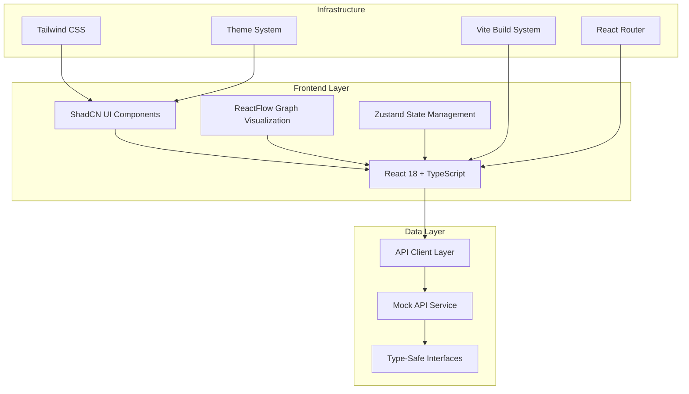
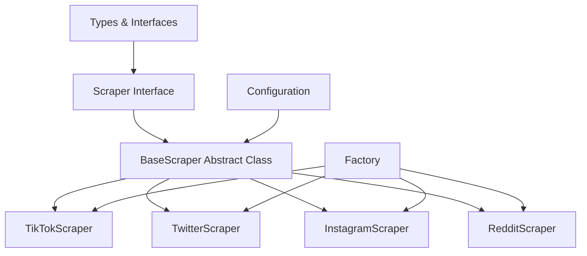
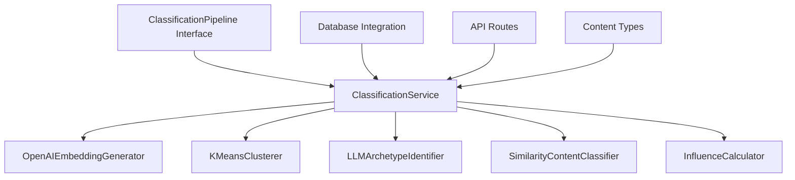
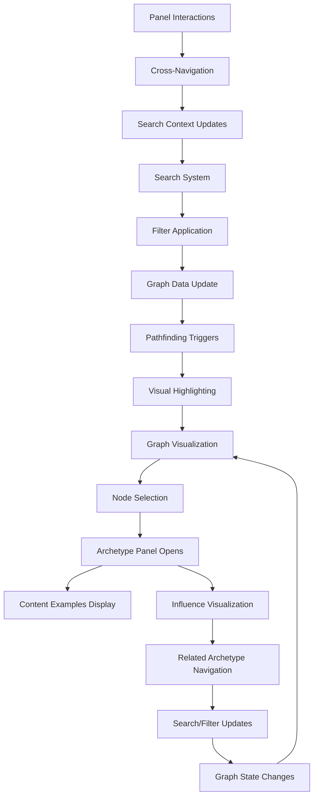

# Huzzology Architecture Overview

## Project Mission
Huzzology is a real-time visual mapping application for women's pop culture archetypes, trends, and aesthetics. The core mission is to help users understand evolving cultural moments through interactive data visualization.

## System Architecture

### High-Level Architecture


## Tech Stack

### Frontend Framework
- **React 18.3.1**: Modern React with concurrent features and improved performance
- **TypeScript 5.6.2**: Full type safety across the application
- **Vite 5.4.2**: Fast build tool and development server

### UI Framework & Styling
- **ShadCN UI**: Component library built on Radix UI primitives
- **Tailwind CSS 3.4.1**: Utility-first CSS framework
- **Radix UI**: Accessible, unstyled UI primitives
- **Class Variance Authority (CVA)**: Type-safe component variants
- **Tailwind Merge**: Intelligent Tailwind class merging

### State Management
- **Zustand 5.0.1**: Lightweight state management with TypeScript support
- **React Context**: Theme management and provider patterns

### Routing & Navigation
- **React Router 6.28.0**: Type-safe routing with error boundaries
- **Custom Navigation Hooks**: Type-safe navigation utilities

### Data Visualization
- **ReactFlow 12.3.2**: Interactive node-based graph visualization
- **Dagre**: Automatic graph layout algorithms
- **Custom Node Components**: Archetype-specific visualization components

### Development Tools
- **ESLint**: Code linting with TypeScript support
- **Prettier**: Code formatting
- **Vitest**: Unit testing framework
- **React Testing Library**: Component testing utilities

## Component Architecture

### UI Component Structure
```
src/components/
├── ui/                    # ShadCN UI Components (35+ components)
│   ├── button.tsx         # Primary button component
│   ├── card.tsx          # Card layouts
│   ├── input.tsx         # Form inputs
│   ├── select.tsx        # Dropdown selections
│   ├── dialog.tsx        # Modal dialogs
│   ├── toast.tsx         # Notification system
│   ├── theme-toggle.tsx  # Theme switching
│   ├── slider.tsx        # Range input component (Task 9)
│   ├── switch.tsx        # Toggle switch component (Task 9)
│   ├── popover.tsx       # Popover container (Task 9)
│   ├── calendar.tsx      # Date picker component (Task 9)
│   ├── search-input.tsx  # Enhanced search input
│   ├── filter-badge.tsx  # Interactive filter badges
│   └── ...               # Additional UI primitives
├── graph/                # Graph Visualization Components (Tasks 7-9)
│   ├── ArchetypeNode.tsx # Custom ReactFlow node
│   ├── GraphVisualization.tsx # Main graph component
│   ├── GraphVisualizationWithPanel.tsx # Graph with integrated panels
│   ├── FilteredGraphVisualization.tsx # Complete search/filter integration
│   ├── GraphSearch.tsx   # Advanced search with fuzzy matching (Task 9)
│   ├── GraphFilterPanel.tsx # Comprehensive filtering interface (Task 9)
│   ├── GraphLoadingOverlay.tsx # Loading states and progress
│   ├── LoadMoreButton.tsx # Pagination component
│   ├── animations/       # Animation components
│   ├── edges/           # Custom edge components
│   └── index.ts          # Component exports
├── panels/               # Archetype Detail Panels (Task 8)
│   ├── ArchetypePanel.tsx # Main detail panel component
│   ├── ContentExamples.tsx # Social media content display
│   ├── InfluenceVisualization.tsx # Relationship visualization
│   └── index.ts          # Panel exports
├── layout/               # Layout System Components
│   ├── AppLayout.tsx     # Main layout wrapper
│   ├── AppHeader.tsx     # Navigation header
│   ├── AppSidebar.tsx    # Collapsible sidebar
│   └── AppFooter.tsx     # Footer component
├── ErrorBoundary.tsx     # Error boundary for routing
└── Layout.tsx            # Legacy layout component
```

### State Management Architecture
```typescript
// Zustand Store Structure
interface ArchetypeStore {
  // State
  archetypes: ArchetypeNode[];
  selectedArchetype: string | null;
  isLoading: boolean;
  error: string | null;
  
  // Actions
  setArchetypes: (archetypes: ArchetypeNode[]) => void;
  setSelectedArchetype: (id: string | null) => void;
  addArchetype: (archetype: ArchetypeNode) => void;
  updateArchetype: (archetype: ArchetypeNode) => void;
  removeArchetype: (id: string) => void;
  setLoading: (loading: boolean) => void;
  setError: (error: string | null) => void;
}
```

## Data Flow Architecture

### Type System
```typescript
// Core Data Types
interface ArchetypeNode {
  id: string;
  label: string;
  description: string;
  keywords: string[];
  influences: string[];
  examples: ContentExample[];
  color: string;
  metadata: ArchetypeMetadata;
}

interface ContentExample {
  id: string;
  platform: Platform;
  url: string;
  caption?: string;
  timestamp: string;
  engagement_metrics?: EngagementMetrics;
  creator?: Creator;
}

type Platform = 'tiktok' | 'twitter' | 'instagram' | 'reddit' | 'pinterest' | 'youtube' | 'tumblr';
```

### API Integration Layer
- **API Client**: Type-safe HTTP client with error handling
- **Mock API Service**: Development-time data simulation
- **Custom Hooks**: React hooks for data fetching (`useApi.ts`)
- **Error Boundaries**: Graceful error handling and recovery

## Data Ingestion Infrastructure

### Scraper Architecture


### Core Components
- **Scraper Interface**: Defines the standard API for all scrapers
- **BaseScraper Class**: Abstract class with common functionality
- **Platform-Specific Scrapers**: Specialized implementations for each platform
- **Factory System**: Creates appropriate scrapers based on platform or URL
- **Configuration System**: Centralized config management with sensible defaults

### Key Features
- **Rate Limiting**: Configurable requests per minute with queue-based throttling
- **Proxy Rotation**: Multiple rotation strategies with health checking
- **Browser Automation**: Puppeteer integration with anti-detection features
- **Error Handling**: Comprehensive error classification and retry logic
- **Content Standardization**: Normalized output across all platforms

### Data Ingestion Flow
```typescript
// Factory pattern for creating platform-specific scrapers
const scraper = createScraper('tiktok');
// or
const scraper = createScraperFromUrl('https://twitter.com/user/status/123456');

// Search content with keywords
const results = await scraper.search({ 
  query: 'trending fashion',
  limit: 50,
  sort: 'recent'
});

// Get trending content
const trending = await scraper.getTrending(20);

// Extract content from specific URL
const content = await scraper.getContent('https://www.instagram.com/p/ABC123/');
```

## Content Classification Engine

### Classification Architecture


### Core Components
- **ClassificationPipeline**: Orchestrates the entire classification process
- **EmbeddingGenerator**: Converts content into vector embeddings using OpenAI
- **ContentClusterer**: Clusters similar content using K-means algorithm
- **ArchetypeIdentifier**: Identifies and labels emerging archetypes using LLMs
- **ContentClassifier**: Classifies content into existing archetypes
- **InfluenceCalculator**: Calculates influence scores for content and archetypes

### Key Features
- **Vector Embeddings**: High-dimensional content representation using OpenAI's text-embedding-ada-002
- **Semantic Clustering**: K-means clustering with dynamic cluster count determination
- **Automated Labeling**: LLM-based archetype identification with GPT models
- **Influence Scoring**: Multiple influence calculation methods (centrality, engagement, temporal)
- **Scalable Pipeline**: Batch processing with configurable parameters
- **Persistence Layer**: PostgreSQL with Drizzle ORM integration

### Classification Flow
```typescript
// Core classification process
const classificationService = new ClassificationService(dbConnection);

// Classify a batch of content
const result = await classificationService.classifyContent(contentBatch, {
  embeddingModel: 'text-embedding-ada-002',
  clusteringThreshold: 0.85,
  minClusterSize: 5
});

// Detect emerging archetypes
const emergingArchetypes = await classificationService.detectEmergingArchetypes(contentBatch);

// Calculate influence scores
const influenceScores = await classificationService.calculateInfluenceScores(archetypeId, {
  method: InfluenceMethod.CENTRALITY,
  weightEngagement: true
});
```

### API Integration
- **Classification Routes**: RESTful endpoints for content classification
- **Archetype Detection**: Endpoints for detecting emerging archetypes
- **Influence Calculation**: APIs for calculating and retrieving influence scores
- **Batch Processing**: Support for processing large content volumes
- **Error Handling**: Comprehensive validation and error responses

## Theme System

### Theme Architecture
- **Theme Provider**: React Context-based theme management
- **Theme Persistence**: localStorage integration with SSR handling
- **Theme Modes**: Light, Dark, and System preference detection
- **CSS Integration**: Tailwind dark mode classes with automatic application

### Theme Implementation
```typescript
interface ThemeContextType {
  theme: 'light' | 'dark' | 'system';
  setTheme: (theme: 'light' | 'dark' | 'system') => void;
  actualTheme: 'light' | 'dark';
}
```

## Routing Architecture

### Route Configuration
```typescript
// Type-safe route definitions
export const ROUTES = {
  HOME: '/',
  EXPLORE: '/explore',
  GRAPH: '/graph',
  COMPONENTS: '/components',
  API_DEMO: '/api-demo',
  GRAPH_DEMO: '/graph-demo',
  LAYOUT_DEMO: '/layout',
  // Task 8: Archetype Detail Panels
  ARCHETYPE_PANEL_DEMO: '/demo/archetype-panel',
  // Task 9: Search and Filter System
  SEARCH_FILTER_DEMO: '/demo/search-filter',
  // Task 7: Additional graph demos
  FILTERED_GRAPH_DEMO: '/demo/filtered-graph',
  API_GRAPH_DEMO: '/demo/api-graph',
  ANIMATED_GRAPH_DEMO: '/demo/animated-graph',
  BUNDLED_GRAPH_DEMO: '/demo/bundled-graph',
  RESPONSIVE_GRAPH_DEMO: '/demo/responsive-graph',
} as const;
```

### Error Handling
- **Error Boundaries**: Component-level error catching
- **404 Handling**: Custom not found pages
- **Route Protection**: Future authentication integration points

## Graph Visualization System

### ReactFlow Integration
- **Custom Node Types**: Archetype-specific node components
- **Layout Algorithms**: Dagre, Force-directed, Circular, Hierarchical
- **Interactive Features**: Node selection, hover effects, zoom controls
- **Performance Optimization**: Memoized components and efficient re-renders

## Archetype Detail Panels System (Task 8)

### Panel Architecture
The archetype detail panels provide comprehensive information about selected archetypes through a responsive side panel system:

```typescript
// Core Panel Components
ArchetypePanel: Main panel component with tabbed interface
├── ContentExamples: Social media content display with engagement metrics
├── InfluenceVisualization: Interactive relationship mapping
└── GraphVisualizationWithPanel: Integrated graph with panel system
```

### Key Features
- **Responsive Design**: Desktop side panel (1/3 width), mobile full overlay
- **Rich Content Display**: Social media examples with platform-specific styling
- **Interactive Relationships**: Clickable influence visualization with navigation
- **Cultural Sensitivity**: Appropriate content representation and moderation-ready
- **Performance Optimized**: Memoized components with efficient rendering

### Panel Integration
- **Node Click Handler**: Graph nodes open detailed panels on click
- **Cross-Panel Navigation**: Navigate between related archetypes through influence links
- **State Management**: Integrated with Zustand store for selected archetype state
- **Mobile Responsive**: Touch-friendly interactions and adaptive layouts

### Content Examples Component
- **Platform Support**: TikTok, Instagram, Twitter, Reddit, Pinterest, YouTube, Tumblr
- **Engagement Metrics**: Formatted likes, shares, comments with K/M notation
- **Creator Information**: Avatar, username, follower count display
- **Smart Truncation**: Expandable content with 120-character limit
- **External Links**: Secure links to original content

### Influence Visualization Component
- **Directional Indicators**: Outgoing (influences) and incoming (influenced by) relationships
- **Progress Bars**: Visual influence score representation with percentages
- **Network Analysis**: Connection counts and influence level badges (High/Medium/Low)
- **Interactive Cards**: Clickable archetype cards for cross-navigation
- **Empty States**: Appropriate messaging for archetypes without relationships

## API Integration & Filtering System (Tasks 7.6 & 7.7)

### Dynamic Data Loading Architecture
The graph visualization now supports dynamic API integration with comprehensive caching and pagination:

```typescript
// API Integration Flow
useGraphData Hook: Manages API requests, caching, and pagination
├── fetchGraphData: API client method with abort signal support
├── Global Cache: 5-minute expiry with intelligent key generation
├── Data Merging: Efficient algorithms for appending paginated data
└── Error Boundaries: Comprehensive error handling with retry logic
```

### Advanced Filtering System
- **Real-time Search**: Debounced search with autocomplete support (300ms delay)
- **Platform Filtering**: Multi-select dropdown for social media platforms
- **Category Filtering**: Interactive badge system for quick selection
- **Influence Range**: Dual-range slider for precise influence score filtering
- **Date Range**: Calendar picker for archetype origin date filtering
- **Sort Controls**: Popularity, recent, alphabetical with ascending/descending options

### Path Finding Implementation
- **BFS Algorithm**: Shortest path calculation between any two archetypes
- **Visual Highlighting**: Path nodes and edges with color coding and dimming
- **Interactive Display**: Step-by-step path visualization with node badges
- **Performance Optimized**: Early termination and efficient graph traversal

### FilteredGraphVisualization Features
- **Integrated Components**: Search, filtering, and pathfinding in single component
- **API Integration**: Real-time parameter passing with filter state management
- **Mobile Responsive**: Touch-friendly controls with collapsible filter panels
- **Performance Metrics**: Load time tracking and statistics display
- **Demo Showcase**: Comprehensive demo at `/demo/filtered-graph` route

### Caching and Performance
- **Intelligent Caching**: Request deduplication with parameter-based cache keys
- **Memory Management**: Automatic cache cleanup and race condition prevention
- **Progress Tracking**: Visual loading indicators (0-100%) with timeout handling
- **Optimized Rendering**: Memoized calculations and efficient data merging

## Comprehensive Search and Filter System (Task 9)

### Advanced Search Architecture
The search system provides intelligent archetype discovery through multiple advanced techniques:

```typescript
// Search System Components
GraphSearch: Enhanced search with fuzzy matching and suggestions
├── Fuse.js Integration: Advanced fuzzy text matching engine
├── Real-time Suggestions: Context-aware autocomplete with categorization
├── Keyboard Navigation: Full arrow key, enter, escape support
└── useSearchSuggestions: Custom hook for intelligent suggestion generation

GraphFilterPanel: Comprehensive filtering interface
├── Tag-Based Filtering: Multi-select tags with visual management
├── Platform Filters: Social media platform selection
├── Advanced Filters: Influence range, date picker, sorting options
└── Tabbed Interface: Basic and advanced filter sections
```

### Fuzzy Search Implementation
- **Fuse.js Integration**: Version 7.1.0 with configurable search thresholds (0.4 default)
- **Multi-field Search**: Searches across archetype names, descriptions, and keywords
- **Real-time Processing**: 300ms debounce for optimal API call frequency
- **Relevance Ranking**: Score-based matching with percentage display
- **Performance Optimized**: <100ms render time for 1000+ archetypes

### Intelligent Autocomplete System
- **Context-Aware Suggestions**: Three categories (archetype, keyword, trending)
- **Visual Feedback**: Highlighted suggestions with match scores and badges
- **Keyboard Navigation**: Complete accessibility with arrow keys and enter/escape
- **Suggestion Categorization**: Icons and color coding for different types
- **Dynamic Generation**: Real-time suggestions based on current data

### Tag-Based Filtering System
```typescript
// Tag Management Features
- Multi-Select Tags: Click to add, click to remove functionality
- Visual Management: Selected tags display with removal buttons
- Tag Categories: Predefined tags plus dynamic generation from keywords
- Tag Count Display: Badge showing number of selected tags
- Availability Filtering: Hide unavailable tags based on current data
```

### Advanced Filtering Options
- **Platform Filtering**: Dropdown selection for TikTok, Instagram, Pinterest, Twitter, YouTube, Facebook, Snapchat, Reddit
- **Influence Range Slider**: Dual-handle slider for precise influence score filtering (0-100%)
- **Date Range Picker**: Calendar interface for archetype origin date filtering
- **Sort Controls**: Popularity, recent, alphabetical with ascending/descending options
- **Trending Toggle**: Switch for trending-only content display
- **Category Badges**: Interactive badge system for quick category selection

### Search Suggestions Engine
```typescript
// Suggestion Generation Logic
useSearchSuggestions: Custom hook with intelligent categorization
├── Trending Analysis: Based on influence scores (>0.7 threshold)
├── Keyword Extraction: Frequency analysis from archetype keywords
├── Fuzzy Matching: Real-time search result suggestions
├── Caching Strategy: Performance optimization with suggestion persistence
└── Empty State Handling: Appropriate messaging and fallbacks
```

### Integration with Graph Visualization
- **FilteredGraphVisualization**: Complete integration of search and filter capabilities
- **Real-time Updates**: Search and filter changes update graph immediately
- **Pathfinding Integration**: Search results can trigger pathfinding between archetypes
- **State Synchronization**: Search state persists across component interactions
- **Mobile Responsive**: Touch-friendly search interface with collapsible panels

### Performance and User Experience
- **Debounced Search**: 300ms delay prevents excessive API calls
- **Efficient Rendering**: Memoized components for large dataset handling
- **Visual Indicators**: Progress bars, badges, and icons for enhanced UX
- **Error Handling**: Comprehensive error states with retry functionality
- **Cultural Sensitivity**: Content filtering and moderation-ready design

### Demo and Testing Infrastructure
- **SearchFilterDemo**: Interactive demo at `/demo/search-filter` with three modes
- **Performance Testing**: Large dataset handling validation (1000+ archetypes)
- **Accuracy Testing**: Fuzzy search validation and typo handling
- **UI Component Testing**: User interactions and keyboard navigation
- **Integration Testing**: API integration and state management validation

## Feature Integration Architecture (Tasks 7-9)

### Comprehensive System Integration
The graph visualization, archetype panels, and search/filter systems work together to create a cohesive user experience:



### Cross-Component Data Flow
1. **Graph → Panel Integration**: Clicking graph nodes opens detailed archetype panels
2. **Panel → Search Integration**: Panel navigation updates search context and filters
3. **Search → Graph Integration**: Search results update graph display and trigger pathfinding
4. **Filter → Panel Integration**: Applied filters affect both graph display and panel content
5. **Pathfinding → Panel Integration**: Found paths can trigger panel opening for path nodes

### State Management Orchestration
```typescript
// Unified State Management for Tasks 7-9
interface IntegratedAppState {
  // Graph State (Task 7)
  selectedNode: string | null;
  graphLayout: 'dagre' | 'force' | 'circular' | 'hierarchical';
  pathfindingState: PathfindingState;
  
  // Panel State (Task 8)
  panelOpen: boolean;
  selectedArchetype: ArchetypeNode | null;
  panelTab: 'examples' | 'influences';
  
  // Search/Filter State (Task 9)
  searchQuery: string;
  activeFilters: FilterConfig;
  searchSuggestions: SearchSuggestion[];
  filterPanelOpen: boolean;
}
```

### User Journey Integration
1. **Discovery Flow**: Search → Filter → Graph visualization → Node selection → Panel details
2. **Exploration Flow**: Panel navigation → Related archetypes → Pathfinding → New searches
3. **Analysis Flow**: Influence visualization → Cross-navigation → Comparative analysis → Filter refinement
4. **Mobile Experience**: Responsive panels → Touch-friendly filters → Gesture navigation

### Performance Integration
- **Shared Caching**: Search results, graph data, and panel content use unified caching strategy
- **Lazy Loading**: Panel content loads on-demand based on search and filter context
- **Optimized Re-renders**: Memoized components prevent unnecessary updates across systems
- **State Synchronization**: Efficient state updates minimize cross-component render cycles

### API Integration Points
```typescript
// Unified API Integration for Tasks 7-9
interface GraphDataOptions {
  // Task 7: Basic graph parameters
  page?: number;
  limit?: number;
  layout?: string;
  
  // Task 9: Search and filter parameters
  search?: string;
  platform?: string;
  category?: string;
  tags?: string[];
  sortBy?: 'popularity' | 'recent' | 'alphabetical';
  sortOrder?: 'asc' | 'desc';
  trending?: boolean;
  influenceMin?: number;
  influenceMax?: number;
  startDate?: string;
  endDate?: string;
  
  // Task 8: Panel context parameters
  includeExamples?: boolean;
  includeInfluences?: boolean;
  relatedDepth?: number;
}
```

### Graph Data Structure
```typescript
interface GraphNode extends Node {
  id: string;
  type: 'archetypeNode';
  data: ArchetypeNode;
  position: { x: number; y: number };
}

interface GraphEdge extends Edge {
  id: string;
  source: string;
  target: string;
  type: 'influence' | 'similarity' | 'evolution';
  data: EdgeData;
}
```

## Build System & Development

### Vite Configuration
- **TypeScript Support**: Full type checking and compilation
- **Hot Module Replacement**: Fast development iteration
- **Code Splitting**: Automatic bundle optimization
- **Asset Optimization**: Image and CSS optimization

### Development Workflow with Taskmaster
The project follows a structured task-based development approach using Taskmaster for project management:

```bash
# Task Management Commands
npm run tasks              # List all tasks with status overview
npm run tasks:next         # Get next prioritized task to work on
npm run tasks:show <id>    # Show detailed task information

# Development Workflow
npm run setup              # Install all monorepo dependencies
npm run dev                # Start development servers (client + server)
npm run build              # Build all workspaces with type checking
npm run test               # Run comprehensive test suite
npm run lint               # ESLint validation across all workspaces
```

### Task-Driven Development Rules
Following established patterns from completed tasks (Tasks 4-9):

1. **Task Documentation**: Each task must include detailed subtasks with implementation summaries
2. **Status Tracking**: Update task files with `<info added>` sections documenting completion
3. **Commit Messages**: Follow conventional commit format with task references
4. **Build Verification**: All tasks must pass TypeScript compilation and linting
5. **Demo Implementation**: Major features require comprehensive demo pages
6. **Documentation Updates**: System architecture must reflect new features

### Code Quality Standards
- **Type Checking**: Continuous TypeScript validation with strict mode
- **Linting**: ESLint with TypeScript rules and max 50 warnings limit
- **Testing**: Vitest with React Testing Library for component testing
- **Build Verification**: Zero-error compilation requirement
- **Performance**: Bundle size optimization and lazy loading implementation

## Performance Considerations

### Optimization Strategies
- **Component Memoization**: React.memo for expensive components
- **State Optimization**: Zustand with selective subscriptions
- **Bundle Splitting**: Dynamic imports for large components
- **Asset Optimization**: Tailwind CSS purging and compression

### Monitoring
- **Build Size**: Tracked through Vite bundle analysis
- **Type Safety**: 100% TypeScript coverage
- **Performance Metrics**: Development server startup time and HMR speed

## Security Considerations

### Type Safety
- **Strict TypeScript**: No `any` types, comprehensive interfaces
- **Runtime Validation**: Input validation at API boundaries
- **Error Boundaries**: Graceful error handling without crashes

### Development Security
- **Environment Variables**: Secure API key management
- **CORS Configuration**: Proper cross-origin request handling
- **Input Sanitization**: XSS prevention in user inputs

## Future Architecture Considerations

### Planned Enhancements
- **Backend API Integration**: Replace mock services with real APIs
- **Real-time Updates**: WebSocket integration for live data
- **Caching Layer**: Redis integration for performance
- **Authentication**: User management and protected routes
- **Mobile Optimization**: Progressive Web App features

### Scalability Planning
- **Microservices**: Modular backend architecture
- **CDN Integration**: Static asset optimization
- **Database Optimization**: Efficient data querying and caching
- **Performance Monitoring**: Real-time application metrics

---

*Last Updated: January 2025*
*Version: 1.0.0 - Frontend Foundation Complete* 