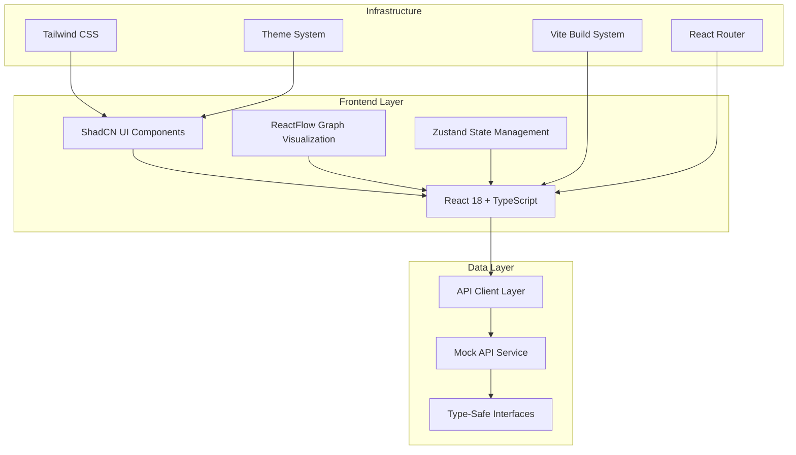
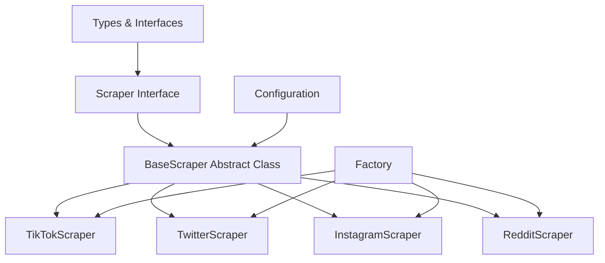
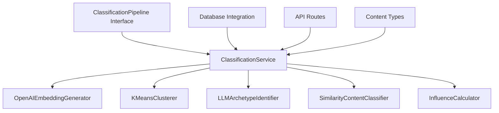
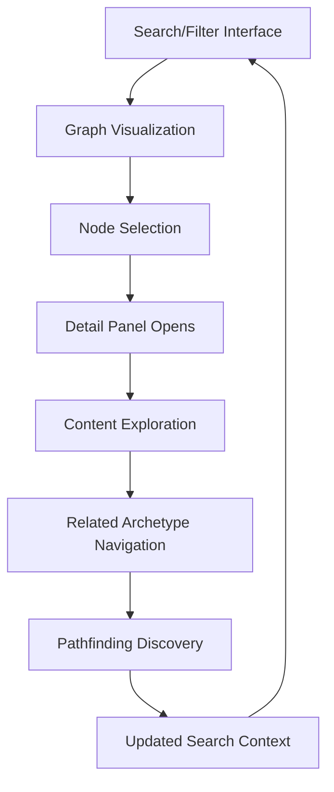

# Huzzology Architecture Overview

## Project Mission
Huzzology is a real-time visual mapping application for women's pop culture archetypes, trends, and aesthetics. The core mission is to help users understand evolving cultural moments through interactive data visualization.

## System Architecture

### High-Level Architecture


## Tech Stack

### Frontend Framework
- **React 18.3.1**: Modern React with concurrent features and improved performance
- **TypeScript 5.6.2**: Full type safety across the application
- **Vite 5.4.2**: Fast build tool and development server

### UI Framework & Styling
- **ShadCN UI**: Component library built on Radix UI primitives
- **Tailwind CSS 3.4.1**: Utility-first CSS framework
- **Radix UI**: Accessible, unstyled UI primitives
- **Class Variance Authority (CVA)**: Type-safe component variants
- **Tailwind Merge**: Intelligent Tailwind class merging

### State Management
- **Zustand 5.0.1**: Lightweight state management with TypeScript support
- **React Context**: Theme management and provider patterns

### Routing & Navigation
- **React Router 6.28.0**: Type-safe routing with error boundaries
- **Custom Navigation Hooks**: Type-safe navigation utilities

### Data Visualization
- **ReactFlow 12.3.2**: Interactive node-based graph visualization
- **Dagre**: Automatic graph layout algorithms
- **Custom Node Components**: Archetype-specific visualization components

### Development Tools
- **ESLint**: Code linting with TypeScript support
- **Prettier**: Code formatting
- **Vitest**: Unit testing framework
- **React Testing Library**: Component testing utilities

## Component Architecture

### UI Component Structure
```
src/components/
├── ui/                    # ShadCN UI Components (35+ components)
│   ├── button.tsx         # Primary button component
│   ├── card.tsx          # Card layouts
│   ├── input.tsx         # Form inputs
│   ├── select.tsx        # Dropdown selections
│   ├── dialog.tsx        # Modal dialogs
│   ├── toast.tsx         # Notification system
│   ├── theme-toggle.tsx  # Theme switching
│   ├── slider.tsx        # Range input component
│   ├── switch.tsx        # Toggle switch component
│   ├── popover.tsx       # Popover container
│   ├── calendar.tsx      # Date picker component
│   ├── search-input.tsx  # Enhanced search input
│   ├── filter-badge.tsx  # Interactive filter badges
│   └── ...               # Additional UI primitives
├── graph/                # Graph Visualization Components
│   ├── ArchetypeNode.tsx # Custom ReactFlow node
│   ├── GraphVisualization.tsx # Main graph component
│   ├── GraphVisualizationWithPanel.tsx # Graph with integrated panels
│   ├── FilteredGraphVisualization.tsx # Complete search/filter integration
│   ├── GraphSearch.tsx   # Advanced search with fuzzy matching
│   ├── GraphFilterPanel.tsx # Comprehensive filtering interface
│   ├── GraphLoadingOverlay.tsx # Loading states and progress
│   ├── LoadMoreButton.tsx # Pagination component
│   ├── animations/       # Animation components
│   ├── edges/           # Custom edge components
│   └── index.ts          # Component exports
├── panels/               # Archetype Detail Panels
│   ├── ArchetypePanel.tsx # Main detail panel component
│   ├── ContentExamples.tsx # Social media content display
│   ├── InfluenceVisualization.tsx # Relationship visualization
│   └── index.ts          # Panel exports
├── layout/               # Layout System Components
│   ├── AppLayout.tsx     # Main layout wrapper
│   ├── AppHeader.tsx     # Navigation header
│   ├── AppSidebar.tsx    # Collapsible sidebar
│   └── AppFooter.tsx     # Footer component
├── ErrorBoundary.tsx     # Error boundary for routing
└── Layout.tsx            # Legacy layout component
```

### State Management Architecture
```typescript
// Zustand Store Structure
interface ArchetypeStore {
  // State
  archetypes: ArchetypeNode[];
  selectedArchetype: string | null;
  isLoading: boolean;
  error: string | null;
  
  // Actions
  setArchetypes: (archetypes: ArchetypeNode[]) => void;
  setSelectedArchetype: (id: string | null) => void;
  addArchetype: (archetype: ArchetypeNode) => void;
  updateArchetype: (archetype: ArchetypeNode) => void;
  removeArchetype: (id: string) => void;
  setLoading: (loading: boolean) => void;
  setError: (error: string | null) => void;
}
```

## Data Flow Architecture

### Type System
```typescript
// Core Data Types
interface ArchetypeNode {
  id: string;
  label: string;
  description: string;
  keywords: string[];
  influences: string[];
  examples: ContentExample[];
  color: string;
  metadata: ArchetypeMetadata;
}

interface ContentExample {
  id: string;
  platform: Platform;
  url: string;
  caption?: string;
  timestamp: string;
  engagement_metrics?: EngagementMetrics;
  creator?: Creator;
}

type Platform = 'tiktok' | 'twitter' | 'instagram' | 'reddit' | 'pinterest' | 'youtube' | 'tumblr';
```

### API Integration Layer
- **API Client**: Type-safe HTTP client with error handling
- **Mock API Service**: Development-time data simulation
- **Custom Hooks**: React hooks for data fetching (`useApi.ts`)
- **Error Boundaries**: Graceful error handling and recovery

## Data Ingestion Infrastructure

### Scraper Architecture


### Core Components
- **Scraper Interface**: Defines the standard API for all scrapers
- **BaseScraper Class**: Abstract class with common functionality
- **Platform-Specific Scrapers**: Specialized implementations for each platform
- **Factory System**: Creates appropriate scrapers based on platform or URL
- **Configuration System**: Centralized config management with sensible defaults

### Key Features
- **Rate Limiting**: Configurable requests per minute with queue-based throttling
- **Proxy Rotation**: Multiple rotation strategies with health checking
- **Browser Automation**: Puppeteer integration with anti-detection features
- **Error Handling**: Comprehensive error classification and retry logic
- **Content Standardization**: Normalized output across all platforms

### Data Ingestion Flow
```typescript
// Factory pattern for creating platform-specific scrapers
const scraper = createScraper('tiktok');
// or
const scraper = createScraperFromUrl('https://twitter.com/user/status/123456');

// Search content with keywords
const results = await scraper.search({ 
  query: 'trending fashion',
  limit: 50,
  sort: 'recent'
});

// Get trending content
const trending = await scraper.getTrending(20);

// Extract content from specific URL
const content = await scraper.getContent('https://www.instagram.com/p/ABC123/');
```

## Content Classification Engine

### Classification Architecture


### Core Components
- **ClassificationPipeline**: Orchestrates the entire classification process
- **EmbeddingGenerator**: Converts content into vector embeddings using OpenAI
- **ContentClusterer**: Clusters similar content using K-means algorithm
- **ArchetypeIdentifier**: Identifies and labels emerging archetypes using LLMs
- **ContentClassifier**: Classifies content into existing archetypes
- **InfluenceCalculator**: Calculates influence scores for content and archetypes

### Key Features
- **Vector Embeddings**: High-dimensional content representation using OpenAI's text-embedding-ada-002
- **Semantic Clustering**: K-means clustering with dynamic cluster count determination
- **Automated Labeling**: LLM-based archetype identification with GPT models
- **Influence Scoring**: Multiple influence calculation methods (centrality, engagement, temporal)
- **Scalable Pipeline**: Batch processing with configurable parameters
- **Persistence Layer**: PostgreSQL with Drizzle ORM integration

### Classification Flow
```typescript
// Core classification process
const classificationService = new ClassificationService(dbConnection);

// Classify a batch of content
const result = await classificationService.classifyContent(contentBatch, {
  embeddingModel: 'text-embedding-ada-002',
  clusteringThreshold: 0.85,
  minClusterSize: 5
});

// Detect emerging archetypes
const emergingArchetypes = await classificationService.detectEmergingArchetypes(contentBatch);

// Calculate influence scores
const influenceScores = await classificationService.calculateInfluenceScores(archetypeId, {
  method: InfluenceMethod.CENTRALITY,
  weightEngagement: true
});
```

### API Integration
- **Classification Routes**: RESTful endpoints for content classification
- **Archetype Detection**: Endpoints for detecting emerging archetypes
- **Influence Calculation**: APIs for calculating and retrieving influence scores
- **Batch Processing**: Support for processing large content volumes
- **Error Handling**: Comprehensive validation and error responses

## Theme System

### Theme Architecture
- **Theme Provider**: React Context-based theme management
- **Theme Persistence**: localStorage integration with SSR handling
- **Theme Modes**: Light, Dark, and System preference detection
- **CSS Integration**: Tailwind dark mode classes with automatic application

### Theme Implementation
```typescript
interface ThemeContextType {
  theme: 'light' | 'dark' | 'system';
  setTheme: (theme: 'light' | 'dark' | 'system') => void;
  actualTheme: 'light' | 'dark';
}
```

## Routing Architecture

### Route Configuration
```typescript
// Type-safe route definitions
export const ROUTES = {
  HOME: '/',
  EXPLORE: '/explore',
  GRAPH: '/graph',
  COMPONENTS: '/components',
  API_DEMO: '/api-demo',
  GRAPH_DEMO: '/graph-demo',
  LAYOUT_DEMO: '/layout',
  // Feature demonstrations
  ARCHETYPE_PANEL_DEMO: '/demo/archetype-panel',
  SEARCH_FILTER_DEMO: '/demo/search-filter',
  FILTERED_GRAPH_DEMO: '/demo/filtered-graph',
  API_GRAPH_DEMO: '/demo/api-graph',
  ANIMATED_GRAPH_DEMO: '/demo/animated-graph',
  BUNDLED_GRAPH_DEMO: '/demo/bundled-graph',
  RESPONSIVE_GRAPH_DEMO: '/demo/responsive-graph',
} as const;
```

### Error Handling
- **Error Boundaries**: Component-level error catching
- **404 Handling**: Custom not found pages
- **Route Protection**: Future authentication integration points

## Graph Visualization System

### ReactFlow Integration
- **Custom Node Types**: Archetype-specific node components
- **Layout Algorithms**: Dagre, Force-directed, Circular, Hierarchical
- **Interactive Features**: Node selection, hover effects, zoom controls
- **Performance Optimization**: Memoized components and efficient re-renders

## Interactive Graph Visualization System

### Core Visualization Architecture
The application centers around an interactive graph visualization system that maps relationships between women's pop culture archetypes:

```typescript
// Graph Visualization Components
GraphVisualization: Main interactive graph component
├── ArchetypeNode: Custom ReactFlow nodes with rich archetype data
├── CustomEdges: Relationship connections with influence indicators
├── Layout Algorithms: Dagre, Force-directed, Circular, Hierarchical
└── Interactive Controls: Pan, zoom, node selection, layout switching
```

### Advanced Search and Discovery
The system provides comprehensive search capabilities for exploring archetypes:

- **Intelligent Fuzzy Search**: Multi-field search across names, descriptions, and keywords
- **Real-time Autocomplete**: Context-aware suggestions with categorization (archetype, keyword, trending)
- **Advanced Filtering**: Platform-specific filters, tag-based filtering, influence range sliders
- **Trending Analysis**: Dynamic recommendations based on influence scores and popularity
- **Performance Optimized**: <100ms render time for 1000+ archetypes with 300ms debounced search

### Archetype Detail System
Detailed information panels provide comprehensive archetype exploration:

- **Responsive Panel Design**: Desktop side panels, mobile overlays with touch interactions
- **Rich Content Display**: Social media examples with engagement metrics and platform styling
- **Influence Visualization**: Interactive relationship mapping with directional indicators
- **Cross-Navigation**: Seamless navigation between related archetypes
- **Cultural Sensitivity**: Appropriate content representation with moderation capabilities

### Dynamic Data Integration
The system supports real-time data loading with intelligent caching:

- **API Integration**: Dynamic data fetching with comprehensive error handling
- **Intelligent Caching**: 5-minute expiry with parameter-based cache keys
- **Pagination Support**: Load-more functionality with efficient data merging
- **Performance Monitoring**: Load time tracking and progress indicators
- **State Management**: Unified state across graph, panels, and search systems

### Pathfinding and Relationship Discovery
Advanced algorithms enable relationship exploration between archetypes:

- **BFS Algorithm**: Shortest path calculation between any two archetypes
- **Visual Highlighting**: Path nodes and edges with color coding and opacity
- **Interactive Display**: Step-by-step path visualization with node navigation
- **Integration Points**: Pathfinding triggers from search results and panel interactions

## System Integration and User Experience

### Unified User Journey
The system creates a cohesive exploration experience through integrated components:



### Cross-Component Data Flow
1. **Search → Graph**: Search queries and filters update graph display in real-time
2. **Graph → Panels**: Node selection opens detailed archetype information panels
3. **Panels → Navigation**: Cross-navigation between related archetypes and influences
4. **Pathfinding → Discovery**: Relationship discovery triggers new search contexts
5. **Mobile Integration**: Touch-friendly interfaces with responsive design patterns

### Performance Architecture
- **Shared Caching Strategy**: Unified caching across search, graph, and panel data
- **Optimized Rendering**: Memoized components prevent unnecessary re-renders
- **Lazy Loading**: On-demand content loading based on user interactions
- **State Synchronization**: Efficient updates minimize cross-component render cycles

### API and Data Management
```typescript
// Unified Data Interface
interface GraphDataOptions {
  // Core parameters
  page?: number;
  limit?: number;
  layout?: string;
  
  // Search and filtering
  search?: string;
  platform?: string;
  category?: string;
  tags?: string[];
  sortBy?: 'popularity' | 'recent' | 'alphabetical';
  sortOrder?: 'asc' | 'desc';
  trending?: boolean;
  influenceMin?: number;
  influenceMax?: number;
  startDate?: string;
  endDate?: string;
  
  // Panel context
  includeExamples?: boolean;
  includeInfluences?: boolean;
  relatedDepth?: number;
}
```

### Graph Data Structure
```typescript
interface GraphNode extends Node {
  id: string;
  type: 'archetypeNode';
  data: ArchetypeNode;
  position: { x: number; y: number };
}

interface GraphEdge extends Edge {
  id: string;
  source: string;
  target: string;
  type: 'influence' | 'similarity' | 'evolution';
  data: EdgeData;
}
```

## Build System & Development

### Vite Configuration
- **TypeScript Support**: Full type checking and compilation
- **Hot Module Replacement**: Fast development iteration
- **Code Splitting**: Automatic bundle optimization
- **Asset Optimization**: Image and CSS optimization

### Development Workflow with Taskmaster
The project follows a structured task-based development approach using Taskmaster for project management:

```bash
# Task Management Commands
npm run tasks              # List all tasks with status overview
npm run tasks:next         # Get next prioritized task to work on
npm run tasks:show <id>    # Show detailed task information

# Development Workflow
npm run setup              # Install all monorepo dependencies
npm run dev                # Start development servers (client + server)
npm run build              # Build all workspaces with type checking
npm run test               # Run comprehensive test suite
npm run lint               # ESLint validation across all workspaces
```

### Task-Driven Development Rules
Following established patterns from completed tasks (Tasks 4-9):

1. **Task Documentation**: Each task must include detailed subtasks with implementation summaries
2. **Status Tracking**: Update task files with `<info added>` sections documenting completion
3. **Commit Messages**: Follow conventional commit format with task references
4. **Build Verification**: All tasks must pass TypeScript compilation and linting
5. **Demo Implementation**: Major features require comprehensive demo pages
6. **Documentation Updates**: System architecture must reflect new features

### Code Quality Standards
- **Type Checking**: Continuous TypeScript validation with strict mode
- **Linting**: ESLint with TypeScript rules and max 50 warnings limit
- **Testing**: Vitest with React Testing Library for component testing
- **Build Verification**: Zero-error compilation requirement
- **Performance**: Bundle size optimization and lazy loading implementation

## Performance Considerations

### Optimization Strategies
- **Component Memoization**: React.memo for expensive components
- **State Optimization**: Zustand with selective subscriptions
- **Bundle Splitting**: Dynamic imports for large components
- **Asset Optimization**: Tailwind CSS purging and compression

### Monitoring
- **Build Size**: Tracked through Vite bundle analysis
- **Type Safety**: 100% TypeScript coverage
- **Performance Metrics**: Development server startup time and HMR speed

## Security Considerations

### Type Safety
- **Strict TypeScript**: No `any` types, comprehensive interfaces
- **Runtime Validation**: Input validation at API boundaries
- **Error Boundaries**: Graceful error handling without crashes

### Development Security
- **Environment Variables**: Secure API key management
- **CORS Configuration**: Proper cross-origin request handling
- **Input Sanitization**: XSS prevention in user inputs

## Future Architecture Considerations

### Planned Enhancements
- **Backend API Integration**: Replace mock services with real APIs
- **Real-time Updates**: WebSocket integration for live data
- **Caching Layer**: Redis integration for performance
- **Authentication**: User management and protected routes
- **Mobile Optimization**: Progressive Web App features

### Scalability Planning
- **Microservices**: Modular backend architecture
- **CDN Integration**: Static asset optimization
- **Database Optimization**: Efficient data querying and caching
- **Performance Monitoring**: Real-time application metrics

---

*Last Updated: January 2025*
*Version: 1.0.0 - Frontend Foundation Complete* 